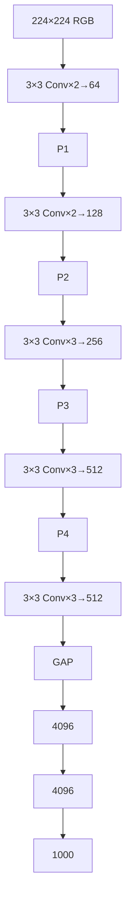

# 딥러닝 CNN 모델 아키텍처 간단 정리 (2014 – 2019)

---

## 목차
| index | 범주 | 상세 목록 |
|-----|------|-----------|
| **1** | VGG → Inception | VGG‑16/19 · Inception‑v1 · Inception‑v2/3 |
| **2** | ResNet's | ResNet‑v1/v2 · Inception‑ResNet & v4 · Wide‑ResNet · ResNeXt · DenseNet |
| **3** | 효율적인 CNN 구조 | SE‑Net · MobileNet‑v1/v2/v3 · EfficientNet‑B0…B7 |

---

## 1 : VGG → Inception

### 1. VGG Net (2014‑09) <a id="vgg-net-201409"></a>

| 구분 | 내용 |
|------|------|
| **제안 논문** | *Very Deep Convolutional Networks for Large‑Scale Image Recognition* (ICLR 2015) |
| **문제 의식** | AlexNet·ZFNet은 **얕고 큰 필터**(11×11·7×7)를 사용 → 충분히 복잡한 패턴 학습에 한계 & 파라미터 과다 |
| **핵심 아이디어** | "**작은 3×3 필터를 깊게** 쌓으면 동일 수용영역(receptive field)을 더 적은 파라미터로 얻을 수 있다" |
| **아키텍처** | `Conv3×3×{2,2,3,3,3} + MaxPool` 5블록 → FC(4096)×2 → Softmax (총 16/19 layer) |
| **성과** | ImageNet Top‑5 에러 7.3 %(VGG‑16) — 당시 2위, 모델 단순성으로 이후 transfer learning 표준 |
| **한계** | 138 M 파라미터·15.5 GFLOPs → 추론·메모리 비용 높음 |



```python
class VGGBlock(nn.Module):
    """3×3 Conv 두 번 + MaxPool"""
    def __init__(self, in_c, out_c):
        super().__init__()
        self.block = nn.Sequential(
            nn.Conv2d(in_c, out_c, 3, padding=1), nn.ReLU(inplace=True),
            nn.Conv2d(out_c, out_c, 3, padding=1), nn.ReLU(inplace=True),
            nn.MaxPool2d(2))
    def forward(self,x):
        return self.block(x)
```

---

### 2. Inception v1 (GoogLeNet, 2014‑09) <a id="inception-v1-201409"></a>

| 항목 | 내용 |
|------|------|
| **제안 논문** | *Going Deeper with Convolutions* (CVPR 2015) |
| **배경** | 최적 필터 크기(1×1? 3×3? 5×5?) 사전 결정 어려움 & 큰 필터 = 연산 폭증 문제 |
| **핵심 아이디어** | 한 "**Inception Module**"에서 1×1·3×3·5×5 Conv, 3×3 MaxPool **병렬** 수행 → 채널 `concat` |
| **연산 최적화** | 3×3·5×5 앞단에 **1×1 Dim‑Reduction**(채널 1/4 축소) → FLOPs 대폭 절감 |
| **보조 분류기** | 중간 출력에 Auxiliary Classifier 2개 → 초기 학습 안정화 |
| **파라미터 수** | 13 M (< VGG 10%) |

```python
class InceptionModule(nn.Module):
    def __init__(self,in_c,c1,reduce3,c3,reduce5,c5,proj):
        super().__init__()
        self.p1 = nn.Conv2d(in_c,c1,1)
        self.p2 = nn.Sequential(nn.Conv2d(in_c,reduce3,1),nn.ReLU(True),
                                nn.Conv2d(reduce3,c3,3,padding=1))
        self.p3 = nn.Sequential(nn.Conv2d(in_c,reduce5,1),nn.ReLU(True),
                                nn.Conv2d(reduce5,c5,5,padding=2))
        self.p4 = nn.Sequential(nn.MaxPool2d(3,1,1),nn.Conv2d(in_c,proj,1))
    def forward(self,x):
        outs=[self.p1(x),self.p2(x),self.p3(x),self.p4(x)]
        return torch.cat(outs,1)
```

---

### 3. Inception v2 & v3 (2015‑12) <a id="inception-v2--v3-201512"></a>

| 개선 | 설명 |
|------|------|
| **Batch Norm** | 모든 Conv 뒤 BN → 학습 안정화 (BN‑Inception) |
| **Factorized Conv** | 5×5 → 3×3×2, 3×3 → (1×3 + 3×1) → 연산량 ↓ |
| **Label Smoothing** | One‑hot → `[0.9, 0.1/(K-1)]` 분포 → 과적합 ↓ |

```python
def cross_entropy_ls(logits, tgt, eps=0.1):
    K = logits.size(1)
    smooth = torch.full_like(logits, eps/(K-1))
    smooth.scatter_(1, tgt.unsqueeze(1), 1-eps)
    return -(smooth * F.log_softmax(logits,1)).sum(1).mean()
```

---

## 2 : ResNet 패밀리

### 4. ResNet (2015‑12) <a id="resnet-201512"></a>

| 항목 | 내용 |
|------|------|
| **제안 논문** | *Deep Residual Learning for Image Recognition* (CVPR 2016) |
| **문제 의식** | 깊이 증가 시 **degradation**(훈련·테스트 오차 동반 상승) → 항등 함수 학습 어려움 |
| **핵심 아이디어** | 층이 직접 **잔차 F(x)=H(x)–x** 를 학습 & **skip connection**으로 `y=F(x)+x` |
| **블록 종류** | *Basic* (3×3 Conv×2, CIFAR) · *Bottleneck* (1×1→3×3→1×1, ImageNet) |
| **대표 모델** | ResNet‑18/34/50/101/152 (Top‑5 에러 3.57 %, 152‑layer) |

```python
class Bottleneck(nn.Module):
    exp=4
    def __init__(self,in_c,mid,stride=1):
        super().__init__()
        out_c = mid*self.exp
        self.conv = nn.Sequential(
            nn.Conv2d(in_c,mid,1,bias=False), nn.BatchNorm2d(mid), nn.ReLU(True),
            nn.Conv2d(mid,mid,3,stride,1,bias=False), nn.BatchNorm2d(mid), nn.ReLU(True),
            nn.Conv2d(mid,out_c,1,bias=False), nn.BatchNorm2d(out_c))
        self.down = nn.Identity() if stride==1 and in_c==out_c else \
            nn.Sequential(nn.Conv2d(in_c,out_c,1,stride,bias=False), nn.BatchNorm2d(out_c))
    def forward(self,x):
        return F.relu(self.conv(x) + self.down(x))
```

#### 4‑1. Pre‑Activation ResNet (v2, 2016‑03)
> BN → ReLU → Conv 순으로 변경해 **항등 경로**를 깨끗이 유지, 1000‑layer CIFAR 실험 성공.

#### 4‑2. ResNet = Ensemble (Veit 2016)
> skip 덕분에 입력→출력 **경로 수 = 2ᴸ**, 얕은 네트워크들의 앙상블처럼 동작한다는 해석.

#### 4‑3. Loss Landscape 시각화 (Li 2018)
> 잔차 연결이 없는 망은 좁고 불규칙한 최소값 vs. ResNet은 **넓고 평탄한 minima**.

---

### 5. Inception v4 & Inception‑ResNet v1/v2 (2016‑02) <a id="inception-v4--inception-resnet-201602"></a>

* Inception‑v3 모듈을 **정제 + 더 깊게** (A/B/C 모듈)
* **Inception‑ResNet** : 인셉션 모듈 출력 + 입력 **Residual sum**
* 채널 1000↑에서 불안정 → `0.1×F(x)` **Residual Scaling**으로 해결

---

### 6. Wide ResNet (2016‑05) <a id="wide-resnet-201605"></a>

| 요소 | 상세 |
|------|-----|
| **아이디어** | 깊이 대신 **폭 k 배** 확장 (WRN‑d‑k) |
| **대표** | WRN‑28‑10 : 28‑layer·k=10 → ResNet‑1001 성능, 학습 8× 빠름 |
| **트릭** | 블록 내부 **Dropout 0.3** → 넓어진 모델 과적합 완화 |

---

### 7. ResNeXt (2016‑11) <a id="resnext-201611"></a>

* **Aggregated Transformations** : 그룹 컨볼루션으로 **Cardinality C** 증가
* ResNeXt‑50 **32×4d** (C=32, group마다 4채널) → ResNet‑50 대비 +1.7 % Top‑1

```python
# 3×3 Group Conv 예시 (64→64, groups=32)
conv_g = nn.Conv2d(64, 64, 3, 1, 1, groups=32)
```

---

### 8. DenseNet (2016‑08) <a id="densenet-201608"></a>

* 모든 이전 출력 `concat` → **특성 재사용**·기울기 흐름 원활·파라미터 효율
* `growth rate k` : 매 레이어 추가 채널 (k=32)
* DenseNet‑121 : 8 M params로 ResNet‑50 성능

```python
for layer in layers:
    x = torch.cat([x, layer(x)], dim=1)  # Dense connectivity
```

---

##  3 : Efficient CNN

### 9. SE‑Net (2017‑09) <a id="se-net-201709"></a>

| 단계 | 연산 |
|------|-----|
| **Squeeze** |  `z_c = 1/HW Σ_{i,j} x_{c,i,j}` (Global AvgPool) |
| **Excitation** | 2×FC (`C → C/r → C`) + sigmoid → 가중치 `s_c` |
| **Scale** | `y_c = s_c · x_c` |

> SE‑ResNeXt‑101 → ImageNet Top‑5 2.25 %(2017 우승)

---

### 10‑12. MobileNet 시리즈 (2017‑04 → 2019‑05) <a id="mobilenet-시리즈-201704--201905"></a>

| 버전 | 구조 | 특징 |
|------|------|------|
| **v1** | `[DW 3×3 + PW 1×1]` 반복 | Depthwise Separable Conv로 FLOPs ≈ 1/9 |
| **v2** | `Inverted Residual (1×1 Expand → DW 3×3 → 1×1 Linear)` | skip 연결은 좁은 입력/출력에, **ReLU6** 사용 |
| **v3** | v2 + **NAS(MNASNet) 탐색**, **h‑swish**, **SE** | Large / Small 두 config |

```python
# v2 Inverted Residual 블록
class InvertedRes(nn.Module):
    def __init__(self,in_c,out_c,exp=6,stride=1):
        super().__init__()
        hid = in_c*exp
        self.use_skip = stride==1 and in_c==out_c
        layers=[nn.Conv2d(in_c,hid,1,bias=False), nn.BatchNorm2d(hid), nn.ReLU6(True),
                 nn.Conv2d(hid,hid,3,stride,1,groups=hid,bias=False), nn.BatchNorm2d(hid), nn.ReLU6(True),
                 nn.Conv2d(hid,out_c,1,bias=False), nn.BatchNorm2d(out_c)]
        self.conv = nn.Sequential(*layers)
    def forward(self,x):
        out = self.conv(x)
        return x+out if self.use_skip else out
```

---

### 13. EfficientNet (2019‑05) <a id="efficientnet-201905"></a>

| 요소 | 설명 |
|------|------|
| **Baseline B0** | NAS로 설계된 MobileNetV2+SE 기반 **MBConv** 블록 |
| **Compound Scaling** | 단일 φ에 대해 깊이 α^φ, 폭 β^φ, 해상도 γ^φ (α·β²·γ² ≈ 2) |
| **시리즈** | B0 (224², 5 M) → … → B7 (600², 66 M) Top‑1 84.4 % |

```python
# MBConv 의사 코드
x = act(BN(expand_conv(x)))   # 1×1 expand
x = act(BN(DW_conv(x)))       # depthwise 3×3/5×5
x = se(x)                     # Squeeze‑Excite
x = BN(project_conv(x))       # 1×1 project
out = x+input if stride==1 and in==out else x
```

---

## 참고 문헌 · 추천 리딩
- **VGG** : Simonyan & Zisserman, *Very Deep ConvNets*, ICLR 2015
- **Inception 시리즈** : Szegedy et al., *Going/Rethinking/Inception‑ResNet*, CVPR 2015‑16
- **ResNet** : He et al., *Deep Residual Learning*, CVPR 2016
- **ResNet‑v2** : He et al., *Identity Mappings*, ECCV 2016
- **ResNeXt** : Xie et al., *Aggregated Residual Transformations*, CVPR 2017
- **DenseNet** : Huang et al., *Densely Connected CNN*, CVPR 2017
- **SENet** : Hu et al., *Squeeze‑and‑Excitation Networks*, CVPR 2018
- **MobileNetV3** : Howard et al., *Searching for MobileNetV3*, ICCV 2019
- **EfficientNet** : Tan & Le, *EfficientNet*, ICML 2019

> 💡 혁펜하임님 legend 13 강의 내용 기반으로 사용되는 모델들을 간단 정리한 자료입니다.

